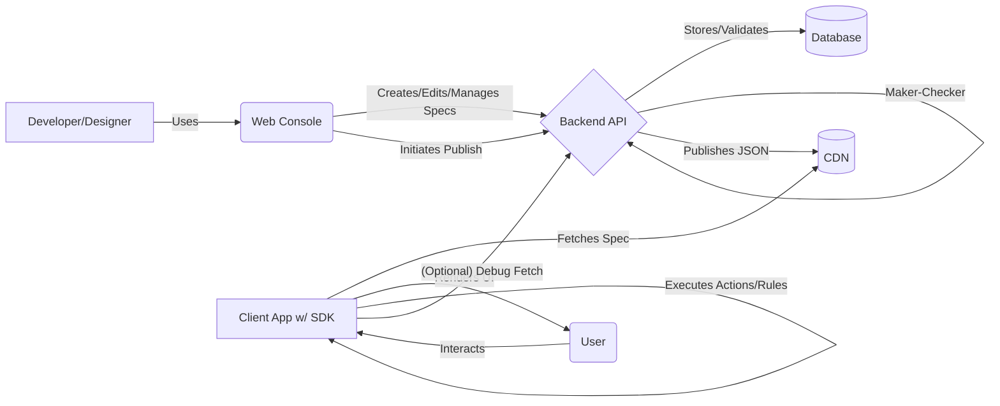

# Technical Architecture Overview

This document provides a high-level overview of the technical architecture for the Devity Server-Driven UI (SDUI) framework.

## 1. Core Components

Devity consists of three primary components and relies on a Content Delivery Network (CDN):

*   **Web Console:** A web application (built with Flutter Web) providing a visual interface for designers, product managers, and developers to create, manage, and publish UI specifications (Specs).
*   **Backend:** A set of services (likely microservices orchestrated via Docker Compose) responsible for:
    *   Storing Spec definitions and component metadata.
    *   Providing APIs for the Web Console.
    *   Validating Specs.
    *   Managing the Maker-Checker publishing workflow.
    *   Transforming internal Spec representations into deployable JSON.
    *   Publishing the JSON Specs to the CDN.
    *   Handling authentication and authorization.
    *   (Potentially) Hosting AI-assistance logic.
*   **Client SDK:** Libraries integrated into target applications (initially Flutter) responsible for:
    *   Fetching the appropriate JSON Spec from the CDN (or Backend in debug mode).
    *   Parsing the JSON.
    *   Rendering the native UI based on the Spec.
    *   Handling user interactions and executing Actions.
    *   Evaluating Expressions and resolving Dynamic Data bindings.
    *   Managing Rules for inter-widget communication.
    *   Allowing registration of custom native components.
*   **Content Delivery Network (CDN):** A distributed network responsible for efficiently and reliably delivering the published JSON Specs to the Client SDKs globally.

## 2. High-Level Interaction Flow

**Diagram Explanation:**

1.  **Spec Creation/Management:** A user interacts with the **Web Console** to build or modify a Spec.
2.  **Backend Interaction:** The Console communicates with the **Backend API** to save, retrieve, and validate the Spec data, which is persisted in a **Database**.
3.  **Publishing:** When ready, the user initiates the publishing process via the Console. This may involve a **Maker-Checker** approval workflow managed by the Backend.
4.  **CDN Deployment:** Upon approval, the Backend transforms the Spec into its final JSON format and uploads it to the **CDN**.
5.  **SDK Fetch (Production):** The **Client App** (containing the Devity SDK) requests the required Spec version from the **CDN**. The CDN delivers the JSON Spec efficiently.
6.  **SDK Fetch (Debug):** Optionally, for debugging or development, the SDK can be configured to fetch the latest (potentially unpublished) Spec directly from the **Backend API**, bypassing the CDN and approval process.
7.  **UI Rendering:** The SDK parses the fetched JSON Spec and renders the corresponding native UI elements for the **User**.
8.  **User Interaction & Actions:** The User interacts with the rendered UI. These interactions trigger **Actions and Rules** defined within the Spec, which are executed by the SDK, potentially leading to state changes, API calls (via `ApiCall` actions), or navigation within the Spec.

## 2.1 Action Execution Flow (Conceptual)

When an event triggers an Action (or sequence of Actions) within the SDK:

1.  **Event Detected:** SDK identifies the trigger (e.g., button click, data change via Rule).
2.  **Action Lookup:** Retrieves the Action definition(s) linked to the event/rule from the parsed Spec.
3.  **Execution Loop (for multiple actions):** Process actions sequentially.
4.  **Parameter Resolution:** For the current action, resolve any attributes using data binding or expressions based on the current SDK state (widget values, API responses, global/screen data).
5.  **Action Dispatch:** Execute the resolved action:
    *   **Standard Action:** Call the corresponding internal SDK handler (e.g., navigate, update widget state, show alert).
    *   **`ApiCall` Action:** Perform the network request using the resolved parameters. Store the response accessible via `{{api.<actionId>...}}`. Trigger `onSuccessActionIds` or `onFailureActionIds`.
    *   **Custom Action:** Look up the registered native handler function and invoke it with the resolved attributes.
6.  **State Update & Re-render:** If the action modifies state data or widget attributes that the UI depends on (via bindings or rules), the SDK triggers a re-evaluation and potential UI update.
7.  **Continue Loop:** Proceed to the next action in the sequence, if any.

This flow ensures that actions are executed based on the current application state and that the UI reacts appropriately to the outcomes.

## 3. Technology Choices (Initial)

*   **Web Console:** Flutter (Web)
*   **Backend:** Microservices via Docker Compose (Language/Framework TBD, e.g., Python/Node.js)
*   **Database:** TBD (e.g., PostgreSQL/MongoDB)
*   **Client SDK (Initial):** Flutter/Dart
*   **CDN:** TBD (e.g., AWS CloudFront, Google Cloud CDN, Cloudflare)
*   **AI Components:** TBD (Likely Python-based)

## 4. Key Architectural Considerations

*   **Scalability:** Backend services and CDN must handle potentially large numbers of specs and high request volumes from clients.
*   **Performance:** Low latency spec delivery (CDN) and minimal performance overhead within the Client SDK are crucial.
*   **Security:** Robust authentication/authorization for Console/API, secure spec delivery, preventing malicious code execution via specs.
*   **Extensibility:** SDK design must allow easy integration of custom native widgets and actions.
*   **Versioning:** Both Specs and SDKs need clear versioning strategies to ensure compatibility.
*   **Decoupling:** Maintain clear separation of concerns between Console, Backend, and SDK.

---

*(Further sections can detail specific service interactions, data models, API strategies, etc. as design progresses)* 